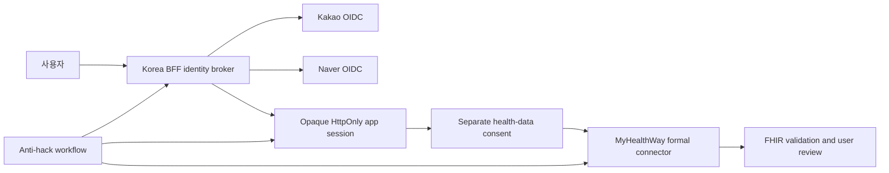

# Identity, Health Access, and Anti-Hack Implementation Plan

**Date:** 2026-08-12 (Asia/Seoul)

**Status:** Task 1 implemented locally; Tasks 2–6 gated

**Data rule:** synthetic identifiers only; no personal health information

**External-state rule:** no provider registration, credentials, API calls, deployment, or account mutation

## Outcome

Users will eventually be able to sign in with Kakao or Naver and, after a separate explicit health-data consent, connect records through the official Health Information Highway/MyHealthWay route. Social login never grants health-data access. There is no direct NHIS password relay, scraping path, shared credential, browser-held provider token, or email-based account merge.

## Provider facts frozen for this plan

| Provider | Current official contract | Product rule |
|---|---|---|
| Kakao | OIDC Authorization Code, RS256 ID token, exact registered redirect URI, `state`, `nonce`, S256 PKCE, server-side token endpoint | Request only `openid` in the initial slice; verify signature, issuer, audience, time, nonce, state, and PKCE; no client secret or token enters browser code/logs. |
| Naver | OIDC Authorization Code, discovery/JWKS, `state`, `openid`, S256 PKCE, server-side client secret, pre-service review | Use the OIDC endpoint family; initial account key is issuer + subject; every optional profile field is absent-by-default and separately consented. |
| Health Information Highway/MyHealthWay | Medical/public-data query APIs, dynamic consent, authentication/support APIs, FHIR exchange; institution registration → testbed → conformity → production transition | Remains disabled until every formal gate and release review is complete. Never substitute NHIS portal scraping or a consumer's NHIS credentials. |

## Anti-hack state machine

Every login attempt receives 256-bit `state`, S256 PKCE material, a five-minute server-side transaction, an exact callback URI, and a closed post-login return path. Kakao also receives a 256-bit nonce. Provider authorization codes are accepted once. Cryptographic ID-token verification precedes account lookup.

| Signal | Mandatory disposition |
|---|---|
| State, PKCE, nonce, issuer, audience, signature, redirect, or replay failure | Block; invalidate the transaction; revoke any issued provider token where supported; rotate app session; emit a redacted alert. |
| Account-link subject collision | Freeze the link; require recent reauthentication and human confirmation; never merge by email/profile similarity. |
| Repeated attempts | Rate-limit and require reauthentication/challenge. |
| Stale/unavailable JWKS | Fail closed; no cached-key grace beyond the reviewed bound. |
| Invalid provider webhook | Verify raw bytes/signature first; reject and alert. |
| Token exposure | Revoke, rotate session, alert, and open incident response. |

Security events contain HMAC-pseudonymized transaction/session/provider-subject/network references only. They contain no token, code, cookie, email, phone number, name, health data, URL query, or raw IP address.

## Task 1 — Local contracts and attack gates (implemented)

Files:

- `apps/web/lib/auth/provider-contracts.ts`
- `apps/web/lib/auth/oauth-transaction.server.ts`
- `apps/web/lib/security/anti-hack-workflow.server.ts`
- `apps/web/scripts/check-auth-security.mts`
- `apps/web/tests/identity-provider-contracts.test.ts`
- `apps/web/tests/oauth-transaction.test.ts`
- `apps/web/tests/anti-hack-workflow.test.ts`

Exit evidence:

- exact HTTPS issuer/endpoints/JWKS/egress hosts;
- 256-bit state/nonce/verifier, S256 challenge, five-minute TTL, one-time transaction;
- pinned `jose` verification of RS256 signatures against a bounded local JWKS, with exact issuer, audience, subject, time, and Kakao nonce checks before account lookup;
- strict mutation failures for state, PKCE, nonce, issuer, audience, signature, expiry, replay, account-link collision, and origin drift;
- source gate rejects browser credential storage, credential logging, public secrets, wildcard CORS, unsafe HTML, and provider-host bypass;
- MyHealthWay connector remains network-disabled with all five formal gates.

## Task 2 — Foundation-owned identity broker (next security-critical implementation)

1. Korea-region encrypted one-time transaction store with conditional consume and five-minute TTL.
2. Exact provider discovery/JWKS clients with response caps, HTTPS-only fixed hosts, no redirects/proxy, bounded cache, unknown-`kid` single refetch, and stale-key fail-close.
3. Wire the pinned local `jose` verifier into the Foundation broker with RS256 algorithm lock and exact issuer/audience/nonce/time validation.
4. Server-side token exchange, encrypted refresh-token vault only if a released use requires it, provider revoke/unlink, and no provider token in the app session.
5. Opaque rotating app session cookie: `HttpOnly`, `Secure` in production, `SameSite=Lax`, narrow path/domain, bounded lifetime.
6. CSRF token + strict Origin checks for every cookie-authenticated mutation.
7. Edge and app rate limits for start/callback/link/unlink/recovery; deterministic transaction and session replay stores.
8. Exact Kakao/Naver egress additions to Network Firewall and DNS Firewall, preserving the existing no-general-egress rule.
9. Redacted telemetry, alerting, containment, token revocation, session kill, and incident runbooks.

## Task 3 — Connection experience

- Korean-first Kakao and Naver sign-in buttons that follow each provider's brand rules without visual dominance.
- A separate “건강정보 연결” screen that explains purpose, data categories, duration, revocation, deletion, and source freshness before any health-data consent.
- Recent-auth account linking and unlinking; no silent merge; recovery never trusts email alone.
- Honest states: `준비 중`, `기관 승인 대기`, `연결 가능`, `연결됨`, `재동의 필요`, `중단됨`.
- WCAG, keyboard, 200% text, reduced-motion, and Korean long-copy tests.

## Task 4 — External provider readiness (requires separate external-state approval)

- Register Kakao and Naver applications and exact production/staging callback/logout URIs.
- Enable OIDC and client-secret protection; request only the minimal profile scopes that a reviewed user flow proves necessary.
- Complete Naver pre-service review and Kakao consent/unlink/webhook configuration.
- Store credentials only in the approved secret manager and prove no lower-environment/CI/browser exposure.
- Run real-provider conformance in an authorized test environment with non-health test accounts.

## Task 5 — Health Information Highway/MyHealthWay (post-MVP)

- Complete organization registration, testbed approval, implementation-guide pinning, supported-resource matrix, conformity approval, and production-transition approval.
- Implement dynamic consent, platform authentication, encrypted exchange, source/provenance preservation, FHIR/KR Core validation, revocation, correction, deletion, and audit.
- Keep public NHIS directory APIs in the public-reference plane; they never substitute for consented personal records.
- Do not promise a launch date until the operating approval and current guide are in hand.

## Task 6 — Release security evidence

- Threat model and abuse cases for login CSRF, code interception, mix-up, replay, session fixation, account linking, recovery, credential stuffing, webhook forgery, SSRF, token leakage, insider access, and provider compromise.
- SAST/SCA/secret/IaC/container gates, signed SBOM/provenance, dependency review, and CSP/security-header runtime proof.
- Independent penetration test, account-takeover drill, provider outage drill, JWKS rotation drill, revoke/unlink drill, session-kill drill, and incident recovery.
- No Critical/High release finding without owner, evidence, rollback, and explicit acceptance.

## What remains to develop

| Priority | Work | Completion evidence |
|---|---|---|
| P0 | Foundation identity broker and app session | All mutation/replay/crypto/rate-limit tests plus Korea-only deployment proof. |
| P0 | Core account, consent, purpose, authorization, audit, deletion | Object/property/function/purpose/consent negative tests and tombstone/restore proof. |
| P0 | Secure document upload → OCR candidate → user review → FHIR record | Synthetic end-to-end path, quarantine, malware/type limits, provenance, default source deletion. |
| P0 | Anti-hack operations | WAF/edge limits, CSP/headers, alerting, session kill, token revoke, incident drills, penetration test. |
| P0 | Legal/privacy/MFDS review of the actual build | Written intended-use and personal-data-flow approval before any beta. |
| P1 | Kakao/Naver provider registration and reviewed connection UX | Provider review, exact callbacks, minimal scopes, unlink/re-consent evidence. |
| P1 | Public HIRA/NHIS/MOHW source connectors | Dataset-specific rights, provenance, freshness, drift/recall, public-only isolation. |
| P1 | Medical extraction runner productionization | Approved model weights/licenses, pinned OCI runtime, representative eval, no-network proof. |
| P1 | Bounded explanations and evidence recall | Claim-level provenance, full safety eval, signed evidence and recall drills. |
| P1 | Mobile vault and signed export/import | Device keystore, offline/no-egress proof, export signature, reset/delete tests. |
| Post-MVP | MyHealthWay production connector | Formal onboarding and all conformance/consent/revocation gates. |
| Conditional | Certified genetics wallet | Signed G0 and all legal/lab/scientific/device-only controls. |

## Stop conditions

Stop immediately if implementation requires a real credential, personal health record, unapproved external account, general internet egress, email-based identity merge, browser token persistence, NHIS scraping, or a claim that the MyHealthWay connection is live. These require the corresponding owner and approval gate; they are not engineering shortcuts.
