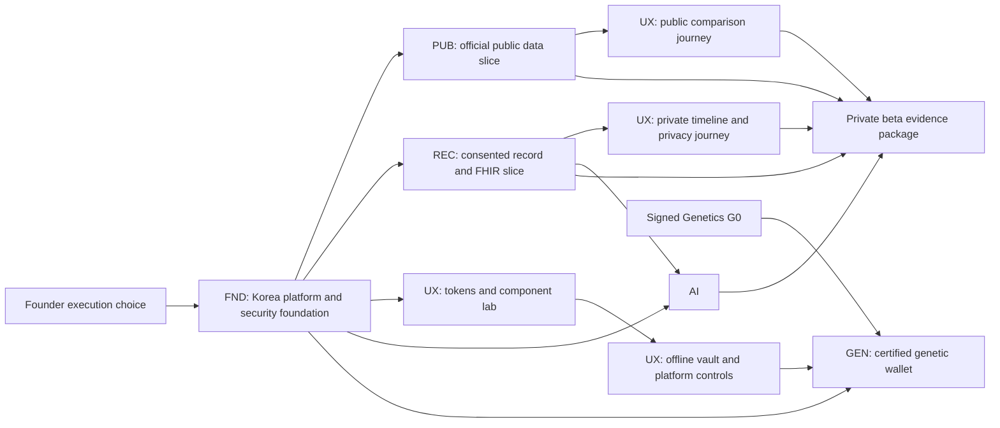

# Genome Companion Korea — Implementation Roadmap

This is the sequencing and governance index for the founder-approved design. It is not an authorization to build, deploy, procure, mutate an external account, or process real personal health data. Each linked implementation plan is independently reviewable and produces a working, testable slice.

## Approved baseline

The founder resolved all eight design gates on 2026-08-09:

- Lead with the annual-checkup, lab-history, and record companion; genetics is optional and independently gated.
- Use consumer-paid and fixed-fee software/information revenue; no patient-, booking-, conversion-, or success-based medical fees pending written counsel approval.
- Use a consented hybrid document path: on-device where supported; Korea-region quarantined cloud processing only after explicit purpose-bound consent.
- Use HAPI FHIR with FHIR R4 and KR Core 2.0.0.
- Keep MyHealthWay post-MVP behind a disabled adapter seam.
- Delete source documents immediately after verified extraction by default; encrypted retention is opt-in.
- Keep the personal-data plane in Korea; a future US plane is separate.
- Use the Midnight Evidence Ledger direction with accessibility/usability release gates.

Authoritative record: [`../../../governance/founder-approval-2026-08-09.md`](../../../governance/founder-approval-2026-08-09.md).

## Executable plan set

| ID | Workstream | Working deliverable | Dependencies | Execution status |
|---|---|---|---|---|
| FND | [`2026-08-09-platform-foundation-security.md`](2026-08-09-platform-foundation-security.md) | Korea-region, testable modular-monolith foundation with identity, consent, IaC, CI, audit, recovery, and security controls | Founder execution choice; counsel/classification work may run in parallel | Plan-ready; not executed |
| PUB | [`2026-08-09-public-data-comparison.md`](2026-08-09-public-data-comparison.md) | Governed HIRA/MOHW/KDCA connector set with immutable bronze data, schema-drift/conflict quarantine, provenance APIs, non-covered item discovery/prices, provider directory, corrections, and source-faithful caveats | FND contracts, public-only runtime, and source approvals | Plan-ready; not executed |
| REC | [`2026-08-09-personal-record-fhir.md`](2026-08-09-personal-record-fhir.md) | Consented document-to-user-verified-record flow, HAPI/KR Core validation, timeline, signed export, retention, profile reset, and deletion | FND identity/consent/storage; synthetic documents only at first | Plan-ready; not executed |
| AI | [`2026-08-09-ai-explanation-safety.md`](2026-08-09-ai-explanation-safety.md) | Korea-hosted private deterministic template explanation worker with its own governed signed evidence release, S0-S3 policy, citations, recall/kill switches, and release evals | REC verified `FactPacket`; FND purpose/workload-token and private-runtime contracts; independent clinical evidence review | Plan-ready; not executed |
| UX | [`2026-08-09-product-experience.md`](2026-08-09-product-experience.md) | Shared tokens, Storybook, public comparison, Seoul private BFF, document review, privacy flows, signed-export importer, encrypted offline Flutter vault, and conditional local OCR | FND repo/CI/runtime; PUB, REC, and consent OpenAPI contracts | Plan-ready; not executed |
| GEN | [`2026-08-09-certified-genetic-wallet-conditional.md`](2026-08-09-certified-genetic-wallet-conditional.md) | Signed certified-result import, device-only encrypted wallet, deterministic knowledge join, safety side-load, recall/export/delete, and zero-egress proof | Signed Genetics G0; UX vault/keystore/platform/privacy contracts; FND Android/iOS CI markers; approved lab/assay/trait/result tuples | Conditional plan-ready; Task 1 governance/tooling may execute pre-G0, while Tasks 2–9 stay blocked until CI verifies the immutable seven-role production G0 envelope, exact tuple/content allowlists, and release-root bootstrap; not MVP baseline |

## Architecture and dependency flow

The MVP has two launch-critical tracks that converge at private-beta evidence: `FND → PUB → UX Task 3` for the transparent provider/non-covered-price wedge, and `FND → REC → UX Tasks 4–6 → AI/UX explanation integration` for the private record companion. PUB and REC run in parallel after their FND seams freeze; neither a backend-only REC/AI build nor a comparison API without its accessible source/caveat UI counts as beta-ready. A synthetic internal record study may precede AI integration, but the founder-approved public beta requires both journeys and the bounded explanation gate. GEN is outside that path.

## Phase sequence and planning ranges

These are staffing and sequencing ranges, not delivery promises. They assume a core team of one technical lead, two backend/data engineers, one mobile engineer, one web/product engineer, one security/platform engineer, fractional clinical/data governance, and external Korean counsel/regulatory review. Fewer people increase elapsed time; external approvals can dominate all ranges.

| Phase | Planning range | Parallel work | Exit evidence |
|---|---:|---|---|
| 0. Authority and intended-use lock | 2–4 weeks | Legal flow review, MFDS classification memo, data-source terms, threat-model workshop, user-research script | Approved claim boundary, processor map, source access matrix, risk owners, synthetic-data policy |
| 1. Foundation | 3–5 weeks | FND only on the critical path; UX tokens may begin after repository contract lands | Dev/staging isolation, CI attestations, identity/purpose-token contract, consent ledger, PHI-safe telemetry, restore proof |
| 2. Public trust slice | 4–6 weeks | PUB plus UX public components | Approved HIRA/MOHW/KDCA sources end-to-end, source/freshness/caveat on every fact, drift/conflict quarantine, correction recall, comparison usability proof |
| 3. Private record slice | 6–9 weeks | REC plus UX mobile/private web | Explicit consent, quarantined upload, extraction review, KR Core validation, verified timeline, default source deletion, export/delete evidence |
| 4. Bounded explanations | 4–6 weeks | AI plus UX integrated explanation states | 100% hard-boundary and emergency-route eval pass, zero unsupported claims in release set, 100% claim citation coverage, evidence recall proof |
| 5. Internal alpha hardening | 3–5 weeks | Security, accessibility, recovery, data-quality, support exercises | No real PHI yet; pen-test findings triaged; backup restore/tombstone replay; incident and recall exercises; WCAG/usability gates |
| 6. Private beta readiness | 4–8 weeks plus external review | Counsel/MFDS review of actual build, operations, support training | Every Section 18 release gate signed; no unresolved critical risk; named owner/rollback for accepted high risks |
| 7. Post-MVP connectivity | External-schedule dependent | MyHealthWay testbed/conformity/onboarding, supported source additions | Formal approval, pinned implementation guide, supported-resource conformance, consent/revocation tests |
| G. Conditional genetics | 8–12 weeks after signed G0 | Independent mobile/security/science/lab stream | Certified lab and allowlist current; cryptographic vectors; scientific/content approval; zero genetic egress; recall/export/delete proof |

## Execution waves

### Wave A — Contracts and proof environments

Execute FND Tasks 1–4 first to freeze repository layout plus identity, purpose-token, consent/options/receipt, and module interfaces. UX token work may start after FND Task 1. FND Tasks 5–8 then establish telemetry/audit, organization/runtime outputs, supply-chain policy, and the exact CI/release extension markers; no dependent workstream may edit those markers or integrate deployment before Task 8 lands. FND Tasks 9–11 remain required release gates for deletion, restore/tombstone replay, and compliance evidence. Only synthetic records with explicit `SYNTHETIC` markers are permitted.

### Wave B — Two vertical slices

Run PUB and REC in parallel after FND contract review. Each slice must reach a working path through ingestion/import, validation, storage, API, UI fixture, negative tests, operations, and rollback. Do not create a generic data lake or generalized agent framework before these two slices prove their interfaces.

### Wave C — Experience integration

UX token/component tasks may begin in Wave A; public and private integrated routes wait for their exact API contracts. Review in Korean at mobile and desktop sizes, 200% text, keyboard/screen-reader use, high contrast, reduced motion, stale/error/unknown states, and long government-source names.

### Wave D — Explanation compiler

AI begins after REC freezes user-verified fact packets and FND freezes purpose/workload authorization plus its private runtime seam. AI owns a separate clinically reviewed, signed evidence-release builder; it may cite approved primary public evidence but does not wait for or pretend PUB produces that artifact. The enabled MVP generator is a deterministic template compiler in the Korea-hosted private worker—“local” means no remote model provider, not on-device execution. A remote model experiment requires a separate approved plan, data-flow review, egress tests, and intended-use reassessment.

### Wave E — Release evidence, not feature expansion

Freeze feature scope. Complete authorization-negative testing, OWASP ASVS evidence, dependency/SBOM/signature checks, Korean-region restore, deletion/tombstone replay, source/evidence/policy/template recall, red-team safety cases, accessibility, support escalation, and counsel/MFDS review of the actual screens and behavior.

## Mandatory checkpoints

| Checkpoint | Reviewer group | Blocking question |
|---|---|---|
| C0 — Design-to-contract | Founder, architecture, product, legal/regulatory | Do implemented intent, copy, revenue, data flow, and exclusions still match the approved baseline? |
| C1 — Security foundation | Security, privacy, platform | Are Korea residency, identity/purpose authorization, keys, logs, CI, audit, restore, and deletion foundations demonstrably fail-closed? |
| C2 — Public data | Data owner, product, legal | Is every fact lawful to use, correctly normalized, source-linked, fresh/caveated, and reversible on drift/correction? |
| C3 — Personal record | Privacy, clinical/data governance, security | Can a user consent, verify, correct, retain/delete, export, revoke, and understand provenance without hidden processing? |
| C4 — AI safety | Clinical safety, evidence owner, security | Do hard boundaries pass completely and does every released claim trace to one verified fact and one active evidence claim? |
| C5 — Experience | Korean users, accessibility reviewer, product, privacy | Is the niche design understandable, non-coercive, legible, accessible, and honest about uncertainty? |
| C6 — Private beta | Founder, legal/MFDS, security, clinical safety, operations | Is every release gate evidenced with owner, date, rollback, and no unresolved critical risk? |
| G0/G1 — Genetics | Founder, laboratory, legal, regulatory, science, security, accessibility | Are certification, trait scope, evidence, signatures, zero-egress, correction, accessibility, and recall current and independently approved? |

No single reviewer may approve their own security, clinical-safety, regulatory, or data-quality exception.

## Environment and data progression

| Environment | Data allowed | External access | Promotion rule |
|---|---|---|---|
| Local | Generated synthetic fixtures only | Mock government/lab/evidence-template services | Unit, property, contract, and static security tests pass |
| Dev | Synthetic fixtures and public open data approved for development | Official sandbox/test endpoints only | Connector/license record and security baseline approved |
| Staging | Synthetic plus separately approved de-identified validation set in Korea | Official conformity/test endpoints | Full release suite, restore, deletion, recall, egress capture, and reviewer sign-off |
| Production | Minimum consented user data for released purposes | Allowlisted production endpoints | C6 signed, counsel/classification current, change approved, rollback rehearsed |

Raw personal health records and genetics are never copied from production into a lower environment.

## Program-wide completion evidence

Before public beta, the evidence directory must contain:

- actual claim/intended-use and exclusion screenshots reviewed by Korean counsel and the MFDS owner;
- connector record, license/terms, attribution, schema, freshness, provenance, and kill-switch evidence for every public source;
- FHIR R4/KR Core 2.0.0 validator output for every supported resource/profile and invalid fixtures;
- purpose/object/property/function authorization negative-test results;
- telemetry, network, notification, URL, crash, and third-party capture showing zero prohibited fields;
- signed SBOM/provenance, vulnerability results, secret scan, IaC policy, container signature, and deployment approval;
- consent options/grant/revoke, default source deletion, opt-in retention, signed export, **health-profile reset**, processor deletion, local-vault reset, backup tombstone replay, and restore results; Cognito identity-account deletion is explicitly post-MVP and must not be claimed by these flows;
- source/evidence/policy/template correction and recall exercise results;
- Korean safety evaluation, subgroup/applicability review, accessibility, reduced-motion, 200% text, and user-usability findings;
- incident owner, support escalation, data-quality owner, rollback command, recovery time, and immutable audit reference for each release.

## Scope-change rule

The following require a new specification and plan rather than an extra task in these plans: identity-account closure/deletion and re-registration semantics, diagnosis, symptom triage beyond deterministic emergency routing, prescribing/dose/adherence advice, provider recommendation/ranking based on personal health, automatic referral/booking compensation, wearable monitoring alerts, caregiver delegation, research reuse, remote model access to personal facts, personal-health embeddings, server-side genetics, raw genomics, pharmacogenomics, disease risk, US user-record processing, or Kubernetes adoption.

## Continuous “better plan” lane

The roadmap is a controlled baseline, not a frozen company thesis. Run a quarterly niche tournament without adding unvalidated features to the critical path:

1. Interview at least five users in each live candidate segment around an observed workflow, not a hypothetical AI feature.
2. Test a paid or deposit-backed offer before building a new data plane; waitlist clicks alone do not count as willingness to pay.
3. Score severity/frequency, lawful data availability, evidence quality, intended-use risk, acquisition cost, support burden, gross margin, and 30/90/365-day return behavior using the rubric in the design specification.
4. Promote a candidate only when it beats the current wedge on a predeclared decision rule and does not weaken privacy, referral, clinical, or unit-economics gates.
5. Create a separate spec and implementation plan for the winner; archive the experiment evidence and the rejected alternatives.

Priority challengers are the livelihood/benefits navigator for chronic illness/disability, family/caregiver record organization after robust delegation controls, and medication-history organization that remains strictly non-prescriptive. A certified genetic wallet stays a differentiation module rather than automatically becoming the acquisition or retention core. Review official-source availability, Korean regulatory changes, accessibility findings, support incidents, and source/evidence/template corrections every quarter so a safer or higher-value path can replace an assumption with evidence.

## Execution protocol

1. At execution time, create an isolated worktree using `superpowers:using-git-worktrees`.
2. Choose `superpowers:subagent-driven-development` for fresh task agents and two-stage review, or `superpowers:executing-plans` for checkpointed inline batches.
3. Execute one plan task at a time with its red/green test cycle and commit.
4. Stop at every named checkpoint for evidence review; a passing test does not replace legal, regulatory, scientific, security, or usability review.
5. Update this index and the decision/risk/source registers whenever scope, interface, source, data flow, intended use, or residual risk changes.
