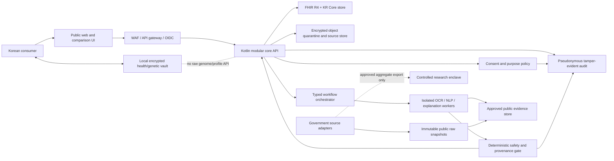
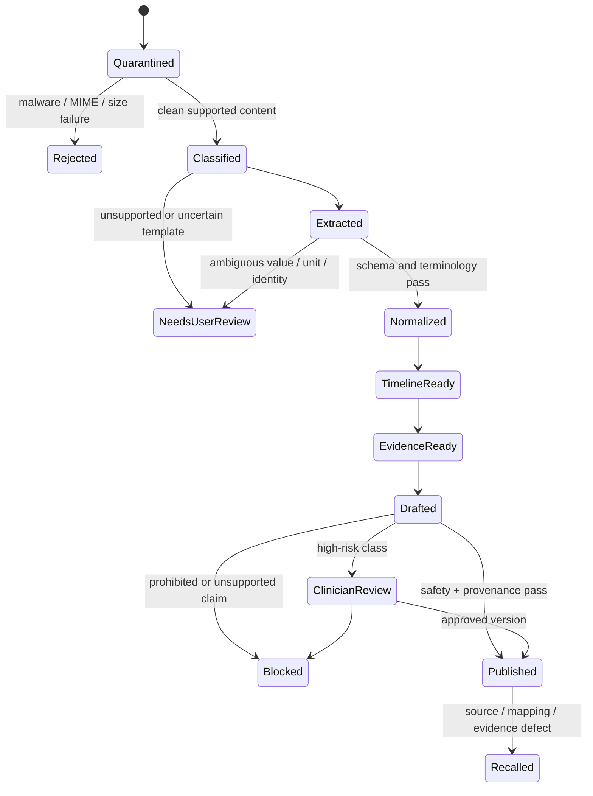
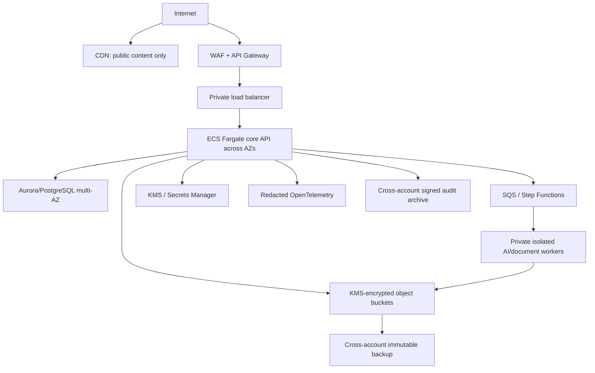

# Genome Companion Korea — Program and Technical Design

**Status:** Founder-review draft

**Date:** 2026-08-08 (Asia/Seoul)

**Scope:** Planning and architecture only; no product implementation is authorized by this document

**Regulatory posture:** Conservative planning baseline, not a Korean or US legal opinion

## Executive decision

Build the company, but do **not** launch as a broad “AI doctor,” a raw-genome interpretation engine, or a direct copy of Ajungdang's transaction-broker model.

The strongest Korea-first wedge is:

> **A private annual-checkup and longitudinal medical-record companion that makes provider information, non-covered prices, source records, changes over time, and questions for a professional understandable.**

The comparison layer earns attention through transparency and livelihood value. The private record layer earns trust, retention, and paid value. A certified-lab genetic wallet can become a differentiated module, but raw genomics and novel medical risk prediction remain outside the MVP.

This recommendation improves the original DNA-first concept in four ways:

1. Annual checkups, lab history, provider choice, and document organization recur; DNA itself does not change.
2. HIRA, NHIS, MOHW, KOSIS, KDCA, NEMC, and MFDS provide useful official reference data, subject to dataset-specific licenses and caveats.
3. The service can create value before a central clinical-AI or raw-genomics pipeline exists.
4. It avoids making genetic evidence the sole basis of retention or pretending that disclaimers neutralize medical-device and medical-practice risk.

The Ajungdang analogy should be copied at the **trust-system** level—plain-language comparison, transparent terms, accessible support, and lifecycle ownership—not blindly at the commission level. Korean [Medical Service Act Article 27](https://www.law.go.kr/LSW/lsInfoP.do?ancYnChk=0&chrClsCd=010202&efYd=20260212&joNo=002700&lsiSeq=279731&urlMode=lsInfoP) prohibits profit-driven patient introduction/referral/solicitation, and [Korean case law](https://law.go.kr/LSW/precInfoP.do?mode=0&precSeq=207141) treats fee-based transaction intermediation differently from neutral information or advertising. Therefore the baseline business model uses consumer payment and fixed software/information fees, not patient-volume or success fees.

## 1. Product and business architecture

### 1.1 Product promise

**Korean:** “내 건강자료가 어디서 왔고, 무엇이 바뀌었으며, 다음 진료에서 무엇을 물어볼지 한눈에.”

**English:** “Know where your health information came from, what changed, and what to ask next.”

The product performs four jobs:

1. **Find:** explain official provider, service, non-covered-price, checkup, drug, and public-health information with source and freshness.
2. **Collect:** import user-owned reports or, after formal onboarding, retrieve consented records through Health Information Highway/MyHealthWay.
3. **Understand:** create a verified timeline, point back to the original record, explain terminology, and show uncertainty.
4. **Prepare:** produce lifestyle-oriented education and a concise list of questions the user may discuss with a licensed professional.

It does not diagnose, prescribe, set a dose, recommend starting/stopping a medicine, promise disease prevention, guarantee provider quality, or autonomously book/route a patient for a referral fee.

### 1.2 Candidate wedges

| Candidate | Recurring job | Data feasibility | Regulatory exposure | Monetization fit | Decision |
|---|---|---|---|---|---|
| Annual checkup + lab-history companion with price/provider transparency | Annual plus follow-up and longitudinal | Strong public-reference path; user documents; MyHealthWay later | Moderate if claims remain informational | Annual membership, one-time analysis, fixed B2B software | **Recommended launch wedge** |
| Certified-test genetic wallet | Low natural frequency; knowledge updates | Strong only with certified lab and signed result | Moderate–high, intended-use dependent | Test bundle, paid module, permanent unlock | Parallel validation / optional module |
| Family/caregiver health-record organizer | High coordination burden and retention | Feasible, but consent/delegation is complex | High privacy/authorization risk | Family plan | Future candidate after delegation controls |
| Medication-history organizer | Recurring, high value | Report/MyHealthWay/MFDS reference data | High if it drifts into interaction or dose advice | Membership/B2B | Later, with hard prescribing boundary |
| Generic symptom/diagnosis chatbot | Frequent | Technically easy, clinically unreliable | Very high | Superficially attractive | **Do not build** |
| Raw WGS/VCF medical interpretation | Infrequent | Technically and scientifically complex | Very high | High ticket, high liability | **Research/regulated future only** |
| Livelihood/benefits navigator for chronic illness/disability | High practical value | Government program/rules data, user documents | Lower clinical but complex eligibility/legal copy | Membership/B2B2C | Run as an adjacent niche tournament candidate |

### 1.3 Revenue model

The baseline economics are intentionally independent of medical referrals:

- Free official-data comparison and education to acquire users.
- One-time “record cleanup and timeline” purchase, price-tested rather than assumed.
- Annual membership for additional imports, changes-over-time reports, knowledge updates, and user-controlled exports.
- Family/caregiver plan only after identity, delegation, and consent are designed.
- Fixed-fee software or data-verification tools for clinics/labs/employers, not tied to patient count, booking, treatment value, or conversion.
- Certified genetic-test module only through a legally structured lab relationship.
- No sale of health/genetic data, advertising targeting from health data, or research/model-training reuse by default.

Illustrative pricing hypotheses for experiments—not approved prices—are ₩19,000–₩39,000 for a one-time record report, ₩39,000–₩79,000 per year for a personal membership, and a lab test plus permanent base genetic wallet at or below the original ₩99,000 target only if written lab/fulfillment quotes support a healthy margin.

### 1.4 Niche-discovery operating system

The company will not freeze around the first concept. Every quarter, a small “wedge tournament” scores new opportunities on:

- problem severity and frequency;
- measurable willingness to pay;
- available lawful data sources;
- regulatory and liability burden;
- customer-acquisition difficulty;
- retention and recurring job;
- trust requirements;
- gross-margin/support burden;
- defensible integration, evidence, or workflow advantage.

The current wedge loses its priority if another niche demonstrates stronger paid demand and retention without a materially worse safety/legal profile.

## 2. Launch scope and user journeys

### 2.1 Personas

1. **Checkup historian:** has years of PDFs and paper results, cannot see what changed, wants to prepare for the next visit.
2. **Cost-conscious planner:** wants transparent checkup/non-covered service information and needs to understand what is and is not comparable.
3. **Quantified-self user:** has wearable/lab histories and values trends, provenance, exports, and privacy.
4. **Certified DNA-test customer:** wants a private, comprehensible explanation of an authoritative lab result without uploading a genome to the startup.
5. **Internal clinical/scientific reviewer:** approves evidence content, mappings, limitations, and recall/rollback.
6. **Data/security operator:** owns connector freshness, consent, access, deletion, incident, and audit evidence.

### 2.2 MVP journey: checkup companion

1. User searches a checkup type, provider, or non-covered item.
2. The product shows official source, source period, retrieval time, fields that are comparable, and explicit caveats.
3. User creates an account with scope/privacy disclosures; health import is separately optional.
4. User imports a supported lab/checkup PDF locally or via a short-lived quarantine upload with explicit consent.
5. The system identifies document type and overlays extracted fields on the source; ambiguous values require confirmation.
6. A deterministic normalizer retains the original text/value/unit and creates versioned FHIR/KR Core-compatible facts.
7. Timeline shows verified values and report-stated reference ranges. No missing value or unit is guessed.
8. An explanation workflow receives a minimal verified fact packet plus approved public evidence.
9. The final policy gate adds limitations, blocks prohibited claims, and emits claim-level provenance.
10. User can export a source-linked visit-preparation summary or delete/reset the private profile.

### 2.3 Optional genetic-wallet journey

1. Certified Korean DTC laboratory performs the test and remains the authoritative testing institution.
2. User imports a lab-signed structured result bundle on the device; a stable partner PDF is a secondary, deterministic adapter.
3. Signature, checksum, lab/test ID, schema version, and supported result codes are verified.
4. A local rules engine maps authoritative result codes to a signed, versioned, medically reviewed knowledge pack.
5. The encrypted profile stays on the device; the startup backend handles commerce/entitlement and public content only.
6. The app explains result, evidence strength, limitations, reasonable general-wellness action, and what the result does not mean.

### 2.4 Explicit MVP exclusions

- minors, pregnancy/fetal genetics, paternity/kinship, ancestry matching, or forensic use;
- VCF, BAM, FASTQ, whole-genome/exome interpretation, novel polygenic scores;
- symptom diagnosis or triage beyond deterministic emergency redirection;
- medication start/stop/dose advice or treatment selection;
- cloud LLM access to raw genetic data or a full identifiable record;
- automatic patient booking, routing, or paid referral;
- research reuse, data sale, targeted ads, or model training on personal health/genetic data;
- family/caregiver access before delegated authorization is built;
- background health monitoring that changes intended use without MFDS review.

## 3. Architectural principles

1. **Clinical truth is deterministic.** AI can explain validated facts; it cannot invent, silently alter, or become the source of a lab value, genotype, diagnosis, medication, provider fact, or consent state.
2. **Bounded agents, not an autonomous swarm.** Every step has typed input/output, scoped identity, allowlisted tools, timeout, budget, idempotency key, and human/automated gate.
3. **Local-first for the highest-risk data.** Raw genomes and derived genetic profiles stay on-device in the baseline. Medical documents are processed locally where feasible; cloud processing is explicit and minimized.
4. **Four data planes.** Public reference, controlled research, consented personal, and local genomic data never collapse into one lake or permission model.
5. **Source before synthesis.** Every displayed personal or public fact exposes origin, source time, retrieval time, transform, confidence, and caveat.
6. **Korea first, region isolated.** Korean personal data remains in a Korean data plane by default. A US launch receives a separate account/database/consent/incident plane.
7. **Privacy by non-collection.** If a feature works without centralizing data, the server never receives it.
8. **Fail closed.** Unknown document, schema, unit, mapping, consent, license, or evidence state abstains instead of guessing.
9. **Modular monolith first.** Strong module/data boundaries without premature microservices or Kubernetes.
10. **Claims are architecture.** Marketing copy, UI labels, model responses, and data flows share an intended-use registry and regulatory change gate.

## 4. System context and trust zones



The web/CDN path carries public content only. Authenticated health APIs, objects, compute, databases, keys, logs, and backups remain region-bound and private. The AI workers cannot call arbitrary internet endpoints or query the entire health database; they receive a task-scoped, minimized fact packet.

## 5. Data classification and planes

### 5.1 Classification

| Class | Examples | Default storage | Key controls |
|---|---|---|---|
| C0 Public | HIRA provider fields, MOHW aggregates, approved evidence copy | Public-reference store/CDN | License, attribution, freshness, integrity |
| C1 Internal | code, non-sensitive configuration, synthetic test fixtures | Standard private systems | Least privilege, change control, backup |
| C2 Personal identifiers | account, contact, consent receipts, order status | Identity/account store | Field separation, encryption, limited staff access |
| C3 Sensitive health | lab values, records, medications, wearable history, free-text health questions | Consented-personal plane | Separate basis/consent, per-purpose access, envelope encryption, deletion workflow, no ordinary telemetry |
| C4 Genetic/highly identifying | raw genotype/VCF/BAM/FASTQ, variants, derived profile | On-device baseline; isolated regulated pipeline only in future | No central MVP endpoint, OS-backed keys, backup exclusion, biometric re-auth, reset-to-zero |

### 5.2 Plane boundaries

**Public-reference plane**

- Only dataset records whose license and product use have been approved.
- Immutable source snapshots plus normalized analytical tables.
- No user identifiers, health records, user queries, or personalization state.

**Controlled-research plane**

- HIRA/NHIS/KDCA row-level or pseudonymized research projects.
- Separate accounts, identities, storage, network, approvals, expiry, and output review.
- No network route or shared database to production; only reviewed aggregate artifacts cross the boundary.

**Consented-personal plane**

- MyHealthWay and user-authorized document/wearable flows.
- Consent, purpose, scope, source, expiry/revocation, recipient, and data-class constraints attached to every access.
- No joining on HIRA/NHIS encrypted catalog identifiers; person linkage follows consented or statutory routes.

**Local-genomic plane**

- Encrypted profile database, signed result bundle, approved knowledge pack, and optional local assistant.
- Account/entitlement services cannot import the genome/profile module.
- Deletion removes the database, source cache, personalized assistant history, temporary parser artifacts, and data key.

## 6. Korean government-data architecture

### 6.1 Approved access strategy

| Source | Production use | Integration method | Main caution |
|---|---|---|---|
| data.go.kr / HIRA | Provider, hospital detail, codes, evaluations, non-covered fees, drug/reference datasets where license permits | Registered service key; REST XML/JSON; server-side scheduled connector | Dataset-specific license, quota, schema, cadence, encrypted identifiers, third-party rights |
| KDCA | Approved public health content/aggregates and licensed files | Official API/file request | Type 2/4 commercial restrictions; survey/research terms; release lag |
| MOHW | Macro health/welfare indicators | data.go.kr REST JSON/XML | Annual/context data, not current capacity or patient truth |
| KOSIS | Population and health statistics | Registered HTTPS API; JSON/XML/SDMX/bulk | 200 calls/min and 40,000 cells/request; preserve units, notes, dimensions, suppression |
| NHIS public APIs | Checkup/long-term-care institution reference information | data.go.kr REST/XML | Separate from NHIS research DB; verify freshness and terms |
| MyHealthWay | User-consented personal records | Formal testbed/onboarding; FHIR-based APIs; dynamic consent and identity verification | Not an ordinary API key; conformity/production approval; documentation version skew |
| NEMC | Emergency institution/AED references | data.go.kr official API | Operational information may differ; never replace 119/dispatch |
| MFDS | DUR/consumer medicine/approval/pill references | Official REST JSON/XML | Reference only; not independent prescribing/interaction clearance |

The [Public Data Portal license policy](https://www.data.go.kr/ugs/selectPortalPolicyView.do) is enforced per dataset. Type 0/1 data may be candidates subject to attribution/rights; Type 2/4 is excluded from commercial product use without separate permission; Type 3 is conditional because modification is restricted. Controlled HIRA/NHIS/KDCA data is research infrastructure, not a hidden personalization API.

MyHealthWay is the official personal-data path. Its [API description](https://www.myhealthway.go.kr/portal/index?page=Organization%2FPortal%2FMediMyData%2FMydataApi) includes clinical/public queries, dynamic consent, authentication, and FHIR-based exchange, while the [testbed process](https://tb.myhealthway.go.kr/portal/index?page=MediMyData%2FTestbedManual) requires organization registration, testing, conformity review, and production-transition approval.

### 6.2 Connector registry

Every source connector has a governed record:

```yaml
connector_id: hira.noncovered.v1
agency: HIRA
dataset_id: "15001700"
canonical_url: "https://www.data.go.kr/data/15001700/openapi.do"
environment: public-reference
auth_owner: data-platform
approval_stage: development
license_type: "Public Nuri Type 1; verify third-party-rights notice"
commercial_use: conditional-approved
rate_limit: "catalog value + observed backoff policy"
advertised_cadence: "dataset-specific"
last_watermark: null
schema_hash: null
permitted_uses:
  - neutral_information
  - source_attributed_comparison
prohibited_uses:
  - patient_identity_linkage
  - live_capacity_guarantee
  - paid_referral_ranking
```

Keys are held in a managed secret store, never mobile/web code. Requests include a descriptive user agent, bounded concurrency, exponential backoff with jitter, circuit breaker, and cache consistent with source terms.

### 6.3 Bronze / silver / gold pipeline

1. **Acquire:** scheduled pull or approved file; record request parameters without secrets, HTTP status, ETag/last-modified, and response size.
2. **Bronze:** immutable raw response plus SHA-256 checksum, retrieved time, source observation/publication time, connector and schema version.
3. **Validate:** content type, schema contract, record count, null/enum distribution, duplicate keys, unit/currency/date plausibility, suppression and license state.
4. **Silver:** typed source-faithful normalization; preserve original identifiers and values; no patient FHIR projection for aggregate/statistical datasets.
5. **Map:** versioned code/terminology mappings with confidence and reviewer; never discard an unmapped source code.
6. **Gold:** product-specific facts with comparability class, caveat, source period, freshness status, and attribution.
7. **Publish:** signed manifest and atomic version switch; retain rollback version.
8. **Monitor:** schema drift, removed/corrected records, code-set changes, freshness gaps, license changes, and API deprecation.

### 6.4 Public fact contract

```json
{
  "fact_id": "hira:15001700:<source-record-key>:2026-08",
  "subject_type": "provider_service",
  "source": {
    "agency": "HIRA",
    "dataset_id": "15001700",
    "canonical_url": "https://www.data.go.kr/data/15001700/openapi.do",
    "source_period": "as-published-by-source",
    "published_at": null,
    "retrieved_at": "2026-08-08T00:00:00+09:00",
    "license": "verified-at-ingestion"
  },
  "original": {},
  "normalized": {},
  "comparability": "same_item_and_unit_only",
  "caveats": ["Not a quote", "Confirm current price and eligibility with provider"],
  "transform_version": "hira.noncovered.map.v1",
  "schema_hash": "sha256:..."
}
```

No “best hospital” ranking is created from incomparable or reimbursement-oriented fields. Ranking factors are public, user-adjustable, and separated from sponsorship. Paid placement, if ever allowed, is visibly labeled and cannot alter evidence or safety ordering.

## 7. Medical-data and AI-agent architecture

### 7.1 Why these are bounded workflow agents

An “agent” is a versioned task processor inside a deterministic state machine, not an independent actor with blanket access. The orchestrator—not the model—controls identity, data scope, tools, transitions, retries, timeout, and approval. A model cannot promote its own output to a verified fact or call an arbitrary database/network endpoint.

| Stage | Component | Generative? | Input | Output and hard rule |
|---|---|---:|---|---|
| A0 | Intake and malware gate | No | File/object metadata | Approved/rejected MIME, hash, scanner result; never trust extension |
| A1 | Document classifier | Bounded ML | Sanitized pages | Supported template/version or abstain |
| A2 | OCR/layout extractor | Bounded ML | Supported page regions | Text/coordinates/confidence; never a clinical fact |
| A3 | Deterministic parser | No | OCR plus template/schema | Candidate fields with source bounding boxes; unknown unit/value abstains |
| A4 | Terminology normalizer | No + reviewed mappings | Verified candidate fields | FHIR/KR Core-compatible fact, original value/code retained, mapping confidence |
| A5 | Timeline composer | No | Versioned facts | Chronological facts; no causal inference |
| A6 | Evidence retriever | No semantic retrieval over approved corpus | Question + minimal fact types | Versioned source passages/IDs; no open-web medical retrieval in response path |
| A7 | Explanation composer | Yes, constrained | Verified fact packet + approved evidence + policy | Structured draft only; no tool execution or truth mutation |
| A8 | Safety/policy gate | Primarily deterministic; optional independent classifier | Draft + facts + risk policy | Allow, rewrite, require review, or block; model cannot override |
| A9 | Provenance/audit assembler | No | Full workflow metadata | Claim-level source/evidence/version/audit envelope |

Model deployment follows an escalation ladder:

1. **M0 deterministic:** templates, rules, approved copy, and search. This is the launch baseline and can deliver most core value without an LLM.
2. **M1 on-device:** a compact Korean-capable model grounded only in the local profile and signed content pack, after device/performance/safety evaluation.
3. **M2 private Korean compute:** a dedicated model endpoint in the personal-data plane, no public internet, no provider training, minimized task context, strict retention, and processor review.
4. **M3 external API:** prohibited for identifiable health/genetic data in MVP. A future exception needs a PIPA transfer basis, contract, data-flow/retention proof, red-team, and founder/privacy/security approval.

Model quality is selected through the release evaluation, not brand reputation or a generic benchmark. A smaller model that reliably abstains and follows the schema is preferable to a larger model that creates unsupported medical claims.

### 7.2 Workflow state machine



Every transition is idempotent and records workflow ID, user/purpose token, input hash, parser/model/prompt/policy/evidence versions, timestamps, result class, and reviewer where applicable. Raw prompts, document text, and medical values do not enter ordinary application logs.

### 7.3 Fact packet and output contract

The LLM never receives a whole account by default. It receives only the verified facts required for one question:

```json
{
  "task_id": "exp_01...",
  "purpose": "explain_user_selected_lab_trend",
  "safety_class": "S1_INFORMATIONAL",
  "facts": [
    {
      "fhir_ref": "Observation/example/_history/2",
      "source_document_ref": "DocumentReference/example",
      "display_name": "source-verified lab name",
      "original_value": "source value",
      "original_unit": "source unit",
      "effective_at": "source date",
      "verification": "user_confirmed_and_rule_validated"
    }
  ],
  "evidence": [
    {
      "evidence_id": "kdca-content:version:item",
      "source_url": "official canonical URL",
      "reviewed_at": "2026-08-08",
      "permitted_claims": ["general education"],
      "prohibited_claims": ["diagnosis", "treatment", "dose"]
    }
  ],
  "required_sections": [
    "what_the_record_says",
    "change_over_time",
    "uncertainty",
    "general_education",
    "questions_for_professional",
    "sources"
  ]
}
```

The response schema requires:

- claim text and claim type;
- exact supporting personal fact references;
- exact evidence IDs/URLs;
- uncertainty/limitations;
- safety class and permitted action class;
- model, prompt, policy, terminology, and evidence versions;
- `abstain_reason` whenever support is insufficient.

### 7.4 Safety classes

| Class | Example | Behavior |
|---|---|---|
| S0 — navigation | “Where did this value come from?” | Show source overlay and metadata. |
| S1 — information/wellness | “Show how the values in my reports changed” | Verified trend plus general education and uncertainty. No diagnosis or treatment. |
| S2 — sensitive/high impact | Possible abnormality, medication, disease-risk, genetic health finding | Deterministic limitation; clinician/scientific review where enabled; user receives questions to discuss, not a treatment instruction. |
| S3 — prohibited/emergency | Diagnosis, dose change, severe symptom assessment, self-harm, unsupported genetic prediction | Do not answer the requested clinical decision. Show a calm boundary and appropriate professional/emergency route; for immediate danger in Korea, direct to 119/112 as applicable. |

An assistant may say “your source report lists this value outside the report's stated reference range.” It may not independently diagnose a condition from that fact. It never reassures a user that an emergency is safe.

### 7.5 Hallucination and prompt-injection controls

- Treat every uploaded document, OCR string, provider field, and user message as hostile data, never instructions.
- Separate system policy, tool schemas, evidence, and untrusted content with explicit typed channels.
- No shell, browser, email, messaging, payment, booking, prescription, or write-to-record tool is exposed to the explanation model.
- Retrieval corpus includes only approved, versioned sources and reviewed company content; public evidence embeddings contain no personal data.
- Structured output is schema-validated; unknown citations or fact references fail closed.
- Run a deterministic claim checker against permitted/prohibited predicates and source coverage.
- Use a second independent safety classifier only as defense in depth; deterministic rules remain authoritative.
- Red-team Korean prompt injection, indirect injection in documents, citation fabrication, false reassurance, dosage requests, and encoding/spacing attacks.
- No online learning from production personal data. Model or prompt changes require offline evaluation and a controlled release.
- Global kill switches can disable a model, evidence pack, connector, or output class without an app release.

### 7.6 Evaluation

Evaluation sets are versioned and contain synthetic or properly authorized data:

- golden field extraction for every supported document template;
- Korean lab unit/range/date/name edge cases;
- terminology mapping fixtures, including unmapped/ambiguous codes;
- longitudinal duplicate/correction tests;
- unsupported evidence and forced-abstention cases;
- diagnosis, medication, pregnancy/minor, emergency, and genetics boundary prompts;
- prompt injection and poisoned-document cases;
- population-applicability and uncertainty language review;
- clinician/scientist scoring for factuality, evidence support, harmful omission, false reassurance, and actionability.

Release targets include 100% provenance coverage for personalized claims, zero invented source references in the release set, 100% pass on hard-boundary cases, and no silent value/unit mutation. These are gates, not claims of observed production performance.

## 8. Canonical health-data model

### 8.1 Standards

- **Exchange:** HL7 FHIR R4 (4.0.1) with [KR Core 2.0.0](https://www.hl7korea.or.kr/fhir/krcore/STU2/downloads.html) validation at Korean clinical boundaries.
- **Labs/observations:** LOINC where licensed/mapped, original Korean/local code retained.
- **Clinical concepts:** SNOMED CT through Korea's member route; KCD/ICD and Korean claims/EDI codes retained where they are authoritative.
- **Units:** UCUM plus original display unit and conversion provenance.
- **Drugs:** Korean product/ingredient/reference identifiers from approved HIRA/MFDS sources; no assumption that international drug IDs are equivalent.
- **Provenance/security:** FHIR Provenance and AuditEvent plus application consent/purpose/audit extensions.

The [FHIR R4 Provenance resource](https://hl7.org/fhir/R4/provenance.html) records how a resource came to be, while [AuditEvent](https://hl7.org/fhir/R4/auditevent.html) records security-relevant use. They are complementary, not interchangeable.

### 8.2 MVP resource set

`Patient`, `RelatedPerson` (future), `Organization`, `Practitioner` (when supplied), `Encounter`, `Observation`, `DiagnosticReport`, `Condition` (only when present in authoritative source), `MedicationStatement`/`MedicationRequest` (source-dependent), `Procedure`, `Immunization`, `DocumentReference`, `Consent`, `Provenance`, and `AuditEvent`.

No model-created diagnosis is stored as `Condition`. An AI hypothesis or explanation remains a separately typed `GeneratedExplanation` application record with evidence and safety status; it never masquerades as a clinician-authored FHIR resource.

### 8.3 Source-faithful observation model

Every normalized observation retains:

- source document/API and exact source location;
- original label/code/value/unit/reference text;
- normalized value/unit only where conversion is deterministic;
- effective/specimen/report/import timestamps separately;
- source organization and test method if supplied;
- terminology mapping version, confidence, and reviewer;
- correction/supersession relationship;
- user confirmation state;
- provenance and consent purpose.

If two labs use different methods or reference ranges, the UI cannot imply direct comparability merely because labels are similar.

### 8.4 Operational FHIR versus analytical models

FHIR is the transactional/interchange truth for personal records. Public KOSIS/claims aggregates keep source-faithful analytical schemas. A future OMOP warehouse is a derived, de-identified/consented research product, never the live application record and never a pathway around consent or research-access controls.

## 9. Application and API boundaries

### 9.1 Modular monolith

```text
core-api/
  identity-account/        # account links; no clinical payload logging
  consent-purpose/         # grant, scope, expiry, revocation, receipts
  public-catalog/          # approved government reference facts
  comparison/              # transparent comparable-item rules
  document-intake/         # upload tickets, quarantine state, deletion
  health-record/           # FHIR/KR Core and provenance
  timeline/                # deterministic longitudinal view
  evidence/                # approved source/content versions
  explanation/             # workflow requests and released outputs
  safety-policy/           # claims, risk class, recall, kill switches
  export-deletion/         # user export, reset, deletion ledger
  entitlement/             # subscriptions/modules; no genome content
  audit/                   # pseudonymous security events
```

Module rules are enforced in architecture tests. `public-catalog` cannot import personal-record modules. `entitlement`, analytics, and telemetry cannot import `health-record` or the on-device `genome_core`. AI workers have separate identities and narrowly scoped queues/objects rather than direct database superuser access.

### 9.2 Representative API surface

```http
GET    /v1/public/providers
GET    /v1/public/noncovered-items
GET    /v1/public/facts/{factId}

POST   /v1/consents
GET    /v1/consents
DELETE /v1/consents/{consentId}

POST   /v1/documents/upload-ticket
POST   /v1/documents/{documentId}/confirm-fields
GET    /v1/documents/{documentId}/status
DELETE /v1/documents/{documentId}

GET    /v1/records/timeline
GET    /v1/records/{resourceType}/{id}
POST   /v1/explanations
GET    /v1/explanations/{taskId}

POST   /v1/exports
POST   /v1/profile/reset
```

Absent by design:

```http
POST /upload-genome
POST /diagnose
POST /prescribe
POST /change-medication
POST /refer-patient-for-commission
POST /train-model-on-user-data
```

Every personal API enforces object-, property-, function-, tenant/user-, purpose-, and consent-level authorization. Short-lived OAuth/OIDC tokens use Authorization Code + PKCE. Upload/download URLs are single-purpose, short-lived, content/size constrained, and never carry PHI in the path or query string.

### 9.3 Consent object

```json
{
  "consent_id": "con_01...",
  "subject_id": "sub_pseudonymous",
  "purpose": "build_personal_lab_timeline",
  "sources": ["user_upload"],
  "data_categories": ["lab_report"],
  "operations": ["collect", "extract", "normalize", "explain"],
  "recipients": ["genome-companion-korea"],
  "region": "KR",
  "processor_set_version": "2026-08",
  "expires_at": null,
  "granted_at": "...",
  "revoked_at": null,
  "notice_version": "privacy-notice-ko-v1",
  "signature_receipt": "sha256:..."
}
```

Revocation stops future processing immediately, revokes tokens, queues deletion or legal-retention segregation, and creates a minimal non-medical audit receipt. It does not falsely promise instantaneous physical removal from immutable backups; the disclosed backup-expiry maximum and restore tombstone process apply.

## 10. Recommended technical stack

| Layer | Recommended stack | Reason |
|---|---|---|
| Consumer mobile | Flutter, Riverpod, `go_router`, Drift/SQLite + SQLCipher, native Keychain/Keystore bridges | Shared iOS/Android, local-first vault, predictable state and auditable modules |
| Public/user/admin web | Next.js + TypeScript; Radix/shadcn/Tailwind for consumer/editorial; MUI for dense reviewer/admin surfaces; Storybook | Custom brand without sacrificing accessible primitives and state documentation |
| Core API | Kotlin + Spring Boot modular monolith | Strong typing, mature security/transaction tooling, natural HAPI FHIR integration |
| FHIR | HAPI FHIR + HL7 validator, PostgreSQL, KR Core package | Interoperability-first; one source of truth; package-based validation |
| AI/document workers | Python + FastAPI + Pydantic; PaddleOCR benchmark; Presidio with Korean customizations | Constrained typed workers and mature OCR/NLP ecosystem |
| Workflow | AWS Step Functions + SQS/EventBridge initially | Managed state, retries, audit, least-privilege task identities; no agent framework lock-in |
| Primary database | Managed PostgreSQL/Aurora PostgreSQL, multi-AZ | Transactions, FHIR ecosystem, mature operations |
| Objects | S3-compatible managed object storage with separate quarantine/source/public/audit buckets, KMS encryption | Lifecycle separation, versioning, malware workflow, immutable log option |
| Evidence search | PostgreSQL full text + pgvector for approved public evidence only | Avoid a second search system and prohibit raw personal-health embeddings by default |
| Cache | None until measured; managed Redis only for non-authoritative, non-sensitive short-lived data | Reduces copies and deletion complexity |
| Infrastructure | AWS Seoul, ECS Fargate, API Gateway/ALB, WAF, KMS, Secrets Manager, Organizations, CloudTrail/Config/GuardDuty/Security Hub; OpenTofu | Managed Korea-region baseline and multi-account security without Kubernetes |
| CI/CD | GitHub Actions with OIDC, Trivy, Gitleaks, test suites, SBOM, Cosign signatures/attestations, manual protected production promotion | No static cloud keys; evidence-bearing release process |
| Observability | OpenTelemetry Collector to a region-approved metrics/log backend; no payload capture | Vendor-neutral signals with strict PHI allowlist |

HAPI and Medplum are mutually exclusive choices, not two backends. If the team needs a faster application-first route and proves KR Core/security requirements, Medplum can replace HAPI—not mirror it.

AWS Seoul is the concrete baseline, not a claim of automatic compliance. Before procurement, compare AWS with Korean-region alternatives such as NAVER Cloud/KT Cloud on the exact required managed services, PIPA/ISMS evidence, contract/subprocessor terms, support access, audit export, key control, multi-AZ recovery, price, and exit portability. Change provider only if the alternative passes the same controls without creating an unowned operations burden.

## 11. Server and deployment architecture

### 11.1 Account and network layout

Use separate cloud accounts/projects for:

1. organization management/billing;
2. security tooling;
3. immutable log archive;
4. shared non-sensitive services/artifacts;
5. development/test using synthetic data;
6. Korea production personal-health plane;
7. controlled research projects;
8. ransomware-resistant backup.

Production spans at least three availability zones in the Seoul region where service support permits. Compute and databases have no public IP. Only WAF-protected edge/API endpoints are internet-reachable. Administrative access uses identity-aware, logged, just-in-time sessions—not a permanent bastion or shared VPN credential.



### 11.2 Upload containment

1. Core API issues a one-time upload ticket with exact size/type constraints.
2. User uploads directly to a quarantine bucket encrypted under a quarantine key.
3. Event invokes content sniffing, archive-bomb limits, malware scan, and safe rendering/sandbox.
4. Unsupported or malicious content is isolated and expired; the application never parses it in the core API process.
5. Approved pages are processed by a task-specific worker without public internet egress.
6. Extracted candidates enter user verification; raw/source retention follows the explicit policy and consent.
7. Temporary files, thumbnails, OCR caches, and worker volumes are cryptographically erased/expired.

### 11.3 Resilience

- Multi-AZ application/database and tested failover.
- Point-in-time database recovery plus cross-account, independently keyed immutable backup in Korea.
- Object versioning and narrowly scoped Object Lock for security logs/backup manifests—not user medical content by default.
- Target MVP objectives: RPO ≤ 15 minutes for accepted health facts and RTO ≤ 4 hours for the personal-record API, validated through restore tests; public comparison can degrade to the last signed snapshot.
- Quarterly full restore and twice-yearly regional/dependency outage exercise.
- Overseas disaster recovery is not enabled for Korean personal data until the PIPA transfer basis, notices, subprocessors, support access, and risk decision are complete.

### 11.4 Evolution trigger

Remain on managed containers and a modular monolith until measured evidence shows at least one of:

- independent scaling/security boundary impossible inside the existing deployment;
- sustained workload/team topology requires autonomous release ownership;
- platform maturity can operate Kubernetes safely with on-call, patch, backup, RBAC, and network-policy ownership;
- regulatory segregation requires a separately certified service.

Service extraction follows data/identity boundaries, not fashionable nouns. Kubernetes and a service mesh are Phase 3+ options, not MVP requirements.

## 12. Security architecture

### 12.1 Security program

Use [NIST CSF 2.0](https://www.nist.gov/publications/nist-cybersecurity-framework-csf-20) for program governance, [NIST SP 800-207](https://csrc.nist.gov/pubs/sp/800/207/final) for Zero Trust, [NIST SSDF 1.1](https://csrc.nist.gov/pubs/sp/800/218/final) for development, and [NIST AI RMF](https://www.nist.gov/itl/ai-risk-management-framework) for AI. Map these to PIPA/ISMS-P, OWASP ASVS/API/MASVS/LLM verification, and contract-specific ISO controls.

### 12.2 Zero Trust

- Authenticate and authorize every human, device, workload, queue, object, and administrative action; network location alone grants nothing.
- Consumer identity: OIDC/OAuth authorization code with PKCE, short-lived access tokens, refresh rotation, session/device risk, optional passkey/MFA.
- Workforce identity: phishing-resistant MFA, managed devices, just-in-time role activation, purpose/ticket binding, session recording for privileged actions.
- Workload identity: role-bound short-lived credentials; no embedded/static cloud keys; later SPIFFE/mTLS only where complexity is justified.
- Authorization: deny by default and evaluate subject, resource, action, tenant/user, data class, purpose, consent, environment, device/session risk, and time.
- Break-glass: two-person approval, time-bounded, reason required, high-priority alert, post-event review; no hidden “support can see everything” role.
- Database superuser and KMS key administration are separated; application services cannot alter security-log retention.

### 12.3 Encryption and key management

- TLS 1.3 preferred, TLS 1.2 minimum; modern cipher policy and HSTS for web.
- Envelope encryption using authenticated encryption (for example AES-256-GCM) with unique data keys and KMS/HSM-protected root keys.
- Separate root keys by environment, region, data class, object purpose, and backup; high-risk tenants/users can receive separate encryption contexts/data keys.
- Key policies use least privilege, separation of duties, rotation, disable/revoke procedure, audited recovery, and deletion schedule.
- Field-level application encryption/tokenization for identifiers and especially sensitive health fields where query requirements permit.
- On device: per-install data key protected by iOS Keychain/Secure Enclave or Android Keystore/StrongBox, SQLCipher database, OS file protection, biometric re-auth option, sensitive backup exclusion.
- Secrets are in managed secret stores and ephemeral CI identities, never source, container images, build logs, or support notes.

Do not claim **end-to-end encryption** for a feature if the server can decrypt its content. The server-processing path uses transport encryption plus envelope encryption at rest. True E2EE is reserved for user-controlled device-to-device transfer/export/backup where only user endpoints hold decryption capability. Confidential computing can be evaluated later but does not erase application, key, side-channel, or legal risks.

### 12.4 Tamper evidence and audit

The platform is not “tamper-proof.” It is designed to be tamper-resistant and to make unauthorized modification detectable:

- append-only pseudonymous events without report text, medical values, genetic traits, or free-text questions;
- monotonic event IDs, synchronized clocks, hash chaining and signed daily Merkle/digest roots;
- CloudTrail/config/data-access records copied to an independently administered log account;
- WORM retention for narrowly scoped audit digests/manifests and dual control for retention/policy change;
- periodic verifier recomputes chains and alerts on gaps, reorder, signature failure, or disabled logging;
- externally stored digest/attestation option to survive compromise of the primary account.

Do not put unnecessary PII/PHI into immutable logs because deletion duties and data minimization still apply. [S3 Object Lock](https://docs.aws.amazon.com/AmazonS3/latest/userguide/object-lock.html) is WORM protection, not proof that an entire control plane cannot be destroyed.

### 12.5 Secure software supply chain

- Threat-model with STRIDE plus LINDDUN at every major data-flow or claims change.
- Protected branches, signed commits/releases where practical, two-person review, CODEOWNERS for privacy/security/clinical modules.
- SAST, dependency/SCA, secret, license, IaC, container, mobile, and DAST gates.
- Pinned dependencies and model/container/reference digests; automated update PRs with compatibility/security tests.
- CycloneDX/SPDX SBOM, VEX/exception owner, model/data cards, and provenance attestation per release.
- Cosign verifies deployment artifacts; production admission rejects unsigned/unapproved identity/digest.
- GitHub Actions uses OIDC for short-lived cloud roles; no long-lived deployment key.
- Patch SLAs: actively exploited/critical internet-facing exposure within 24 hours or compensating isolation/disable; other critical within 72 hours; high within 14 days, adjusted by a documented risk decision.
- Public vulnerability disclosure and coordinated response process before beta.

### 12.6 Mobile, API, and privacy engineering

- Apply [OWASP MASVS/MASTG](https://owasp.org/www-project-mobile-app-security/) and [OWASP API Top 10 2023](https://owasp.org/API-Security/editions/2023/en/0x00-header/).
- No PHI in push notifications, widgets, deep-link query strings, clipboard, screenshots by default on sensitive screens, crash reports, analytics, or customer-support attachments.
- Root/jailbreak/emulator signals raise risk but never substitute for cryptography and server authorization.
- Certificate pinning is a separately managed availability/security decision; do not pin third-party cloud certificates that rotate outside our control.
- Egress allowlist and DNS/proxy logs on sensitive workers; no public model endpoint without a reviewed processor route.
- Rate, resource, and cost limits prevent document bombs, model-denial-of-wallet, and enumeration.
- Object/property/function-level negative tests are mandatory for every API release.

### 12.7 Incident, backup, and deletion

- Follow [NIST SP 800-61r3](https://csrc.nist.gov/pubs/sp/800/61/r3/final): named 24/7 owners, severity matrix, evidence preservation, rapid token/key revocation, containment, recovery, regulator/user decision, and lessons learned.
- Korean and English incident templates cover personal/genetic disclosure, wrong interpretation, compromised knowledge pack, partner correction, and service unavailability.
- Twice-yearly tabletop; annual external penetration test before high-risk scale; managed detection/response when internal 24/7 coverage is not credible.
- Deletion reaches databases, objects, caches, search/vector indexes, workflow queues, processors, support systems, exports, and analytics; processors return deletion evidence.
- Backups expire within a disclosed maximum, are not restored into service without deletion tombstones/revocations being replayed, and are quarterly restore-tested.
- Follow [NIST SP 800-88r2](https://csrc.nist.gov/pubs/sp/800/88/r2/final) for sanitization. User reset uses crypto-shredding where safe, followed by lifecycle deletion and an auditable non-medical receipt.

## 13. Compliance-by-design map

| Regime | Applicability posture | Architecture/product response | Mandatory gate |
|---|---|---|---|
| Korean PIPA | Health and genetic information is sensitive; almost certainly applicable when centrally processed | Separate basis/consent, minimization, purpose/consent ABAC, security measures, processor/transfer map, rights, retention/deletion, breach playbooks | Korean privacy counsel and data-flow sign-off before beta |
| PIPA overseas transfer | Applies when data is stored, provided, or remotely viewed abroad under Article 28-8 conditions | Korea-only personal plane; region-approved processors; no foreign support/backup/model by default; separate disclosure/basis if introduced | Subprocessor and remote-access audit per release |
| ISMS/ISMS-P | Threshold/category dependent for a small MVP; strategically valuable early | Control register, risk treatment, evidence, incident/DR, access, SDLC, privacy lifecycle from day one | Annual threshold/legal review; certification readiness before enterprise scale |
| Medical Service Act | Patient referral/intermediation and unlicensed medical activity risk | Neutral comparison; no success/per-patient fees; informational boundaries; no diagnosis/prescribing | Written counsel opinion on compensation, ranking, booking, advertising |
| Digital Medical Products Act / MFDS | Intended-use dependent; even health-support analysis can be in scope | Intended-use/claim registry, feature gates, evidence/change control, post-release recall, separate regulated modules | Written MFDS classification/consultation before public scope freeze |
| Korean AI Basic Act | Generative disclosure and possible high-impact duties | Advance AI notice/labeling, explanation/provenance, human oversight, risk documentation, high-impact assessment | Legal classification and transparency-copy review |
| Bioethics/genetic testing | DTC testing/interpretation requires certified-lab and permitted scope | Startup is not the lab; signed authoritative lab result; no novel disease/PGx inference in MVP | Certified partner scope, counsel, scientific review |
| HIPAA (US) | Role dependent, not universal; can apply as covered-entity business associate | Separate US plane; BAA and HIPAA controls only after role analysis; do not market “HIPAA certified” | HHS role decision + contract/data-flow review |
| FTC HBNR / FTC Act (US) | Likely for non-HIPAA personal-health-record apps combining sources | No ad pixels/unauthorized SDK disclosure; incident inventory and notice workflow | US counsel before launch |
| FDA / US state health privacy | Intended-use and resident/activity dependent | Separate claims/classification; state consent/deletion/geofence rules; region plane | US launch review, not inherited from Korean approval |

The Korean PIPA baseline comes from [Article 23](https://www.law.go.kr/lsLinkCommonInfo.do?chrClsCd=010202&lsJoLnkSeq=1027416043), [Article 29](https://www.law.go.kr/LSW/lsLinkCommonInfo.do?chrClsCd=010202&lsJoLnkSeq=1033215737), and [Article 28-8](https://www.law.go.kr/lsLinkCommonInfo.do?chrClsCd=010202&lsJoLnkSeq=1029334953). ISMS-P is a management system, not a single penetration test; KISA publishes its [control structure](https://isms-p.kisa.or.kr/main/ispims/intro/). Cloud-provider certificates cover the provider scope, not this application; shared responsibility remains.

### 13.1 Intended-use claim registry

Every user-facing claim is a versioned object:

```yaml
claim_id: claim.lab.trend.v1
surface: mobile.timeline
claim_text_ko: "검사 기록의 변화를 보여드립니다. 진단이 아닙니다."
user_population: adults_19_plus
inputs: verified_user_lab_observations
output_class: informational_trend
medical_action: none
evidence_policy: source_record_only_plus_approved_general_education
mfds_status: review_required_before_launch
legal_review: pending
clinical_review: pending
prohibited_expansions:
  - disease_diagnosis
  - treatment_recommendation
  - medication_change
rollback: feature_flag_lab_timeline
```

Changing copy, data, model behavior, audience, or recommended action can change intended use even when code is unchanged. Release tooling blocks unapproved claims and retains the exact copy/screenshots reviewed.

### 13.2 Privacy artifacts required before beta

- complete data inventory and data-flow diagram;
- records of processing, lawful basis, separate sensitive-data consent, and consent receipts;
- processor/subprocessor register and contracts;
- overseas transfer map including remote support/control plane/telemetry;
- retention and deletion matrix, backup expiry, legal holds, and restore tombstones;
- privacy impact assessment and security threat model;
- rights-request procedures and identity verification proportional to risk;
- privacy notice in plain Korean that matches network behavior;
- incident decision tree and notification templates;
- research governance isolated from product consent.

## 14. Visual and interaction design

### 14.1 Direction: Midnight Evidence Ledger

The supplied references establish a super-niche editorial data-journalism language: near-black field, off-white type, oversized figures, monospaced metadata, unit glyphs/dot matrices, hairline rules, strong negative space, and rare cyan/red accents. The product should feel like an independent evidence desk—not a hospital portal, generic wellness gradient, biotech sci-fi page, or trading dashboard.

Suggested tokens for prototype testing:

```css
--ink-950: #08080a;
--ink-900: #101014;
--paper-050: #f3f1ec;
--paper-300: #bbb8b2;
--grid-700: #34343a;
--evidence-cyan: #78dbe8;
--alert-red: #df6b72;
--rule: rgba(243, 241, 236, 0.22);
```

Exact contrast is verified against WCAG 2.2 AA before adoption. Korean body text uses a highly legible Korean sans (for example Pretendard after font-license review); mono is reserved for source IDs, dates, units, versions, and evidence metadata. Do not set Korean paragraphs in a narrow monospaced face.

### 14.2 Visual grammar

- Large number = a value actually present in source data, never decoration.
- Dot/unit grid = a count or proportion with a visible denominator and text equivalent.
- Cyan = verified source/evidence/provenance or selected state.
- Red = safety block, error, or urgent operational warning—not a “bad gene” or moral health score.
- Gray = unavailable, unmapped, stale, or outside comparison; label the reason.
- Hairline rule = context boundary, not a card around everything.
- Perspective fields may appear in editorial hero/story content, not as a control surface or fake scientific certainty.
- Every data graphic has alt text or an adjacent table/summary; color is never the sole carrier of meaning.

### 14.3 Core components

1. **Source masthead:** agency, dataset/report, source period, retrieved/reviewed date, version.
2. **Evidence number:** large value plus unit, reference/source, and comparability state.
3. **Unit matrix:** accessible dot/square/glyph grid with exact count/denominator.
4. **What changed strip:** source-faithful trend with method/range discontinuity markers.
5. **Provenance drawer:** original document overlay, normalized mapping, transformation/version.
6. **Evidence chip:** Strong / Moderate / Limited / Insufficient plus definition—not only color.
7. **Boundary card:** calm explanation of what cannot be concluded and a safe next step.
8. **Privacy badge:** “이 기기에 저장” or precise server-processing state; never a vague shield icon.
9. **Comparison caveat:** explains why items can/cannot be compared and when users should confirm details.
10. **Recall banner:** visible when a source, mapping, or knowledge version is superseded or corrected.

### 14.4 Screen map

- Public: Evidence-led home → checkup/non-covered search → comparison → source detail → methodology/privacy.
- Private: Scope/privacy → import/connect → verify fields → timeline home → fact detail/provenance → Ask/Explain → visit questions → export → privacy/delete.
- Genetic module: certified test handoff → signed import → verification → private profile → evidence-bounded trait detail → local Ask → reset/export.

The mobile home shows three high-confidence, user-relevant jobs—not an anxiety feed or universal “health score.” No longevity score, genetic age, disease countdown, leaderboards, streak pressure, or fear-based notifications.

## 15. Open-source adoption plan

The detailed, current register is in [`technical-architecture/open-source-register.md`](../../../technical-architecture/open-source-register.md). The production shortlist is:

- HAPI FHIR + HL7 validator **or** Medplum, never competing truth stores;
- Flutter and SQLCipher for mobile/local vault;
- Next.js, Radix/shadcn/Tailwind, Storybook, and optional MUI admin surface;
- Spring Boot core API and FastAPI isolated workers;
- PostgreSQL, OpenTelemetry, OpenTofu;
- Trivy, Cosign, Gitleaks, OPA, ZAP, and Prowler as security/supply-chain layers.

PaddleOCR and Presidio are conditional baselines that require Korean/hospital-specific evaluation. OMOP/OHDSI, ONNX Runtime, Kubernetes, DICOM viewers, GA4GH VRS, and nf-core/Sarek are future or research-only. No model weight, terminology pack, or dataset inherits the code repository's license automatically; all artifacts receive separate provenance/license review.

## 16. Phased delivery and gates

This is a program roadmap, not the file-by-file implementation plan. A separate implementation plan will be written only after founder review of this specification.

### Phase 0 — 0–30 days: prove the lane before building

**Work**

- Obtain Korean healthcare/privacy counsel memo on medical referral/advertising, PIPA, certified genetic-test roles, and proposed revenue flows.
- Submit exact intended-use statement, screen prototype, and output examples for MFDS classification consultation.
- Register the first HIRA/NHIS/MOHW/KOSIS connectors and capture license/terms/freshness samples.
- Apply for relevant public API development keys; start MyHealthWay organization/testbed discovery.
- Interview at least 20 checkup historians/cost-conscious planners and 10 certified DNA-test users.
- Test landing-page and refundable/deposit willingness to pay for checkup companion versus DNA wallet.
- Obtain written certified-lab prices, result schemas, certification scope, fulfillment/SLA, and liability allocation from multiple labs.
- Threat-model the four data planes and create the PIPA inventory/consent/retention draft.

**Gate**

Proceed only if one wedge shows real paid intent, at least one lawful data/partner path works, the proposed claims have a viable classification route, and unit economics can support the target price/support load. Otherwise pivot to the strongest adjacent wedge—potentially livelihood/benefits or record organization without medical analysis.

### Phase 1 — 31–60 days: evidence and safety prototype

**Work**

- Build a clickable Korean-first Midnight Evidence Ledger prototype with comparison, source detail, import verification, timeline, provenance, boundary, privacy, export, and delete flows.
- Implement a local/synthetic vertical slice for one or two stable checkup document templates; no open-ended OCR claim.
- Build one HIRA reference connector end to end through bronze/silver/gold and display exact source metadata.
- Create the FHIR/KR Core validation harness and synthetic fixtures; select HAPI or Medplum through a time-boxed proof.
- Define terminology mapping/review workflow and initial evidence content policy.
- Run usability, accessibility, security architecture, and clinician/scientist reviews.

**Gate**

Users must correctly distinguish source fact, explanation, uncertainty, and medical boundary. Supported extraction must have no silent value/unit/date mutation. All network/telemetry tests must show zero C3/C4 payload leakage.

### Phase 2 — 61–90 days: private alpha

**Work**

- Deploy the Korea multi-account, multi-AZ managed-container baseline with synthetic data first.
- Add consent/purpose enforcement, quarantine pipeline, user verification, timeline, source-linked explanation, deletion, and tamper-evident audit.
- Test with a small, explicitly consented adult cohort and only supported document templates.
- Add human review for every released personalized explanation during alpha.
- Run independent web/mobile/API security testing, restore/deletion exercises, and Korean safety red-team.
- Finalize regulator/counsel gates and truthful store/privacy disclosures.

**Gate**

No unresolved critical security finding; 100% hard-boundary and provenance tests; demonstrated delete/restore behavior; approved intended use; support/incident runbooks operational; users find recurring value beyond the first report.

### Phase 3 — 3–6 months: narrow paid MVP

**Scope**

- public comparison for approved HIRA/NHIS/MOHW sources;
- supported checkup/lab document import and verified timeline;
- source/evidence-linked explanations and visit-question summary;
- privacy/reset/export controls;
- no autonomous booking/referral, diagnosis, prescribing, raw genomics, or family delegation;
- genetic wallet only if certified-lab, local-processing, economics, scientific, MFDS, and counsel gates pass independently.

**Operations**

- external penetration test and vulnerability disclosure;
- clinical/scientific content board and recall process;
- formal data quality/freshness SLOs;
- monthly access/processor/deletion audit and quarterly restore/tabletop;
- customer-support scripts that do not practice medicine.

### Phase 4 — 6–12 months: consented connectivity and defensible expansion

- Complete MyHealthWay testbed/conformity/production route; do not promise an integration date before approval.
- Add supported wearable/checkup connections only after privacy and intended-use review.
- Pilot fixed-fee clinic/lab/employer software that is not paid patient referral.
- Evaluate caregiver delegation, medication-history organization, and livelihood/benefits navigator through separate niche tournaments.
- Establish ISMS-P readiness and ISO 27001/27701 roadmap for enterprise procurement.
- Create a separate US data plane only after HIPAA-role, FTC HBNR, state privacy, and FDA intended-use review.

### Phase 5 — regulated modules, not a silent feature update

Pharmacogenomics, disease-risk, clinical decision support, monitoring, raw VCF/WGS, clinician portals, or treatment-linked functions become separate regulated products with validated analytical/clinical performance, quality management, human oversight, post-market monitoring, and recall. They do not inherit MVP approval merely because they reuse its code.

## 17. Metrics and release evidence

### 17.1 Product/business

- qualified search → source-detail → comparison completion;
- import start → verified timeline completion;
- percentage who return for a second record, comparison, export, or knowledge update;
- willingness-to-pay conversion by wedge and price—not waitlist count alone;
- gross margin after data/licensing, lab/fulfillment, cloud/model, payment, support, review, refunds, and compliance;
- support contacts per paid user and percentage requiring clinical escalation;
- 30/90/365-day cohort value appropriate to annual health jobs.

Do not force a monthly subscription if the recurring job is annual. A durable annual membership or paid report can be a better trust/economics fit until wearable/record updates create genuine ongoing value.

### 17.2 Data quality

- source freshness and successful connector runs by dataset;
- schema/code/license drift detection time;
- percentage of displayed facts with complete source/period/retrieval/transform/caveat;
- extraction exact match by field/template and ambiguity/abstention rate;
- terminology mapping coverage, confidence, reviewer, and unmapped backlog;
- correction propagation/recall time.

### 17.3 AI and clinical safety

- claim-level personal-fact and evidence citation coverage;
- unsupported-claim and citation-fabrication rate;
- hard-boundary pass rate;
- false reassurance and harmful omission rate from reviewer rubric;
- abstention appropriateness;
- subgroup/language performance and population-applicability disclosure;
- model/prompt/evidence rollback time.

### 17.4 Privacy/security/reliability

- zero C3/C4 fields observed in automated outbound-traffic/telemetry capture;
- object/property/function authorization negative-test coverage;
- critical/high vulnerability remediation SLA;
- SBOM and verified signature/provenance coverage for every production artifact;
- deletion completion and processor evidence within disclosed SLO;
- unauthorized access, break-glass, and consent-revocation test results;
- backup restore success, measured RPO/RTO, and audit-chain verification;
- mean detect/contain/recover by incident exercise.

## 18. Acceptance and release gates

The product cannot enter public beta unless all are true:

1. The founder approves the exact wedge, business model, intended use, and exclusions.
2. Korean counsel approves the privacy, comparison/ranking, advertising/referral, lab, and compensation model.
3. MFDS classification/required route is documented against actual copy/screenshots/data/model behavior.
4. Every production government source has an approved connector record, license, attribution, schema/freshness checks, and kill switch.
5. FHIR/KR Core conformance and terminology version tests pass for the supported resource set.
6. Every personalized claim in the release evaluation has personal-source provenance, evidence provenance, uncertainty, safety class, and version metadata.
7. Hard diagnosis/medication/emergency/genetic boundary sets pass completely.
8. Automated network capture finds no prohibited health/genetic fields in logs, analytics, crash, notifications, URLs, or third-party calls.
9. Deletion, consent revocation, backup restore/tombstone replay, model/evidence recall, and incident runbooks are tested.
10. No unresolved critical security/privacy/clinical/regulatory risk remains; each accepted high risk has a named owner and rollback.

## 19. Failure modes and deliberate responses

| Failure | Detection | Response |
|---|---|---|
| Government source changes schema or silently stops updating | Contract/freshness/distribution monitor | Quarantine new version; serve last signed version with stale label or disable; notify data owner |
| Wrong document value/unit | Golden tests, plausibility, source overlay, user/reviewer report | Stop publication; recall affected facts/explanations; reparse from retained source only under policy; notify affected users |
| Knowledge/evidence correction | Source change monitor and content board | Revoke signed pack/version, display recall banner, regenerate eligible local explanations, preserve history |
| Model produces prohibited advice | Policy gate, safety eval, user report | Block response, disable output class/model, review task/audit, expand regression set |
| Consent revoked mid-workflow | Consent event and purpose token check at every stage | Cancel queued/running tasks, revoke object URLs/tokens, delete/segregate, issue receipt |
| Admin account compromise | Identity/session/config anomaly | Revoke sessions/keys, isolate account, engage incident plan, validate audit chain, restore known-good control |
| Public ranking accused of bias/pay-to-play | Transparent methodology and change/audit log | Freeze ranking, show raw filters, independent review, separate sponsorship, correct and disclose |
| MyHealthWay category/schema mismatch | Conformity test failure/version mismatch | Pin approved guide, disable affected resource, never transform against marketing-page assumptions |
| Lab partner reissues/corrects result | Signed correction/revocation feed or support event | Verify partner signature, supersede locally, preserve provenance, recall derived explanation |
| User presents emergency symptoms | Deterministic safety classifier/rules | Do not assess severity; show immediate Korean emergency/professional route; no delay through generative flow |

## 20. Founder decisions required after review

This specification proposes, but does not silently decide, the following business choices:

1. Approve the checkup/record companion as the lead wedge, or retain certified-DNA wallet as lead and explain why its retention/economics are stronger.
2. Approve consumer-paid/fixed-fee software revenue as the baseline and prohibit patient/success-based fees pending counsel.
3. Choose whether the MVP supports cloud document processing with explicit consent or only local/on-device supported imports.
4. Choose HAPI FHIR (recommended) or authorize a time-boxed HAPI-versus-Medplum proof before commitment.
5. Decide whether MyHealthWay onboarding is launch-critical or a post-MVP workstream.
6. Set the source-document retention default: immediate post-verification deletion versus user-controlled encrypted retention.
7. Approve the Korea-only personal data plane and separate future US plane.
8. Approve the Midnight Evidence Ledger design direction and its accessibility/usability validation requirement.

## 21. Next planning gate

After the founder reviews this design, resolve the eight decisions above and any comments. Only then invoke the separate implementation-planning workflow to produce work packages, sequencing, test-first tasks, ownership, estimates, and checkpoints. Until that review, this repository remains planning-only.

Supporting evidence and detailed registers:

- [`research/sources/primary-source-register.md`](../../../research/sources/primary-source-register.md)
- [`technical-architecture/open-source-register.md`](../../../technical-architecture/open-source-register.md)
- [`governance/decision-log.md`](../../../governance/decision-log.md)
- [`risks/risk-register.md`](../../../risks/risk-register.md)
